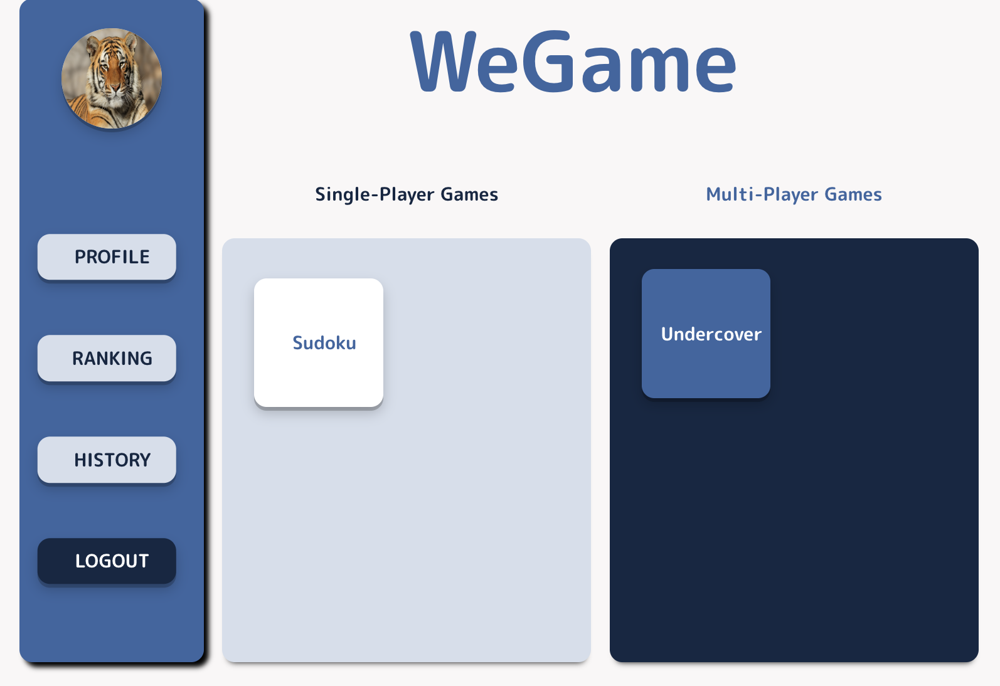
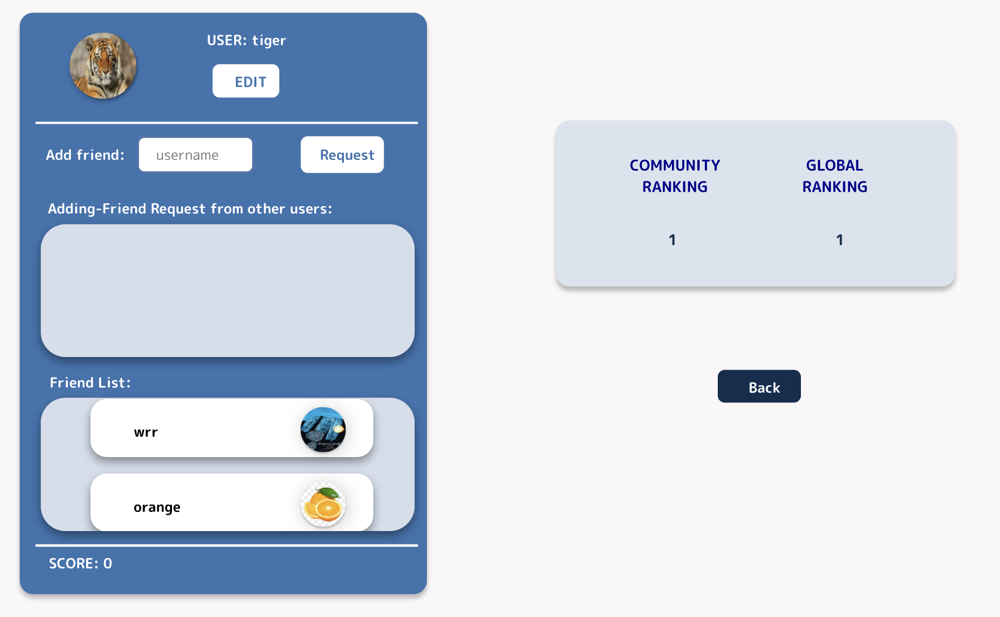
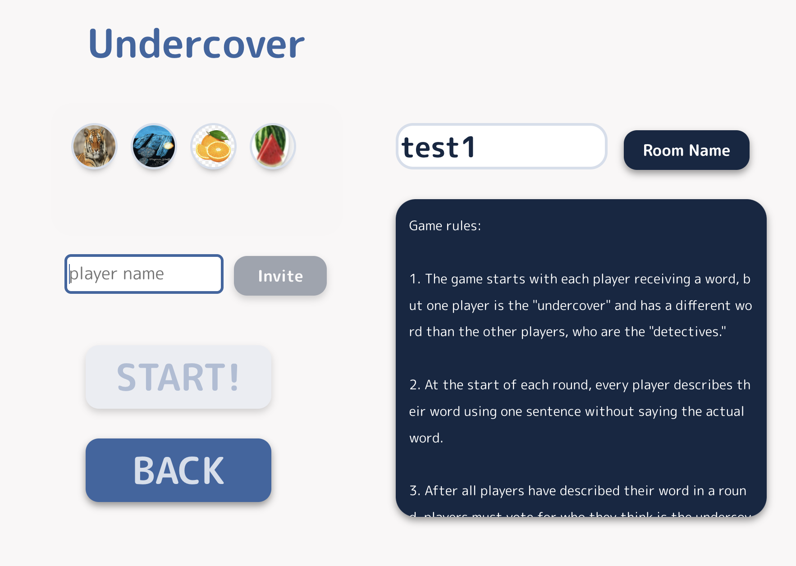

<div align="center">
    <h2>SoPra FS23 - Group 26 Client</h2>
</div>

# WeGame - Game Platform
## Introduction
The idea of our project is to provide a fun and engaging platform for users to enjoy playing games and socializing with their friends. Our game platformn currently contain 1 single-player game Sudoku and 1 multi-player game Who is undercover. On our platform, the user could add friends, view game history, upload their image and also see the ranking among all users.

## Technologies
- React: CSS, SCSS, JavaScript, HTML
- GitHub (Actions)
- REST API

## High-Level Components
The most important components are:
- [Platform](src/components/views/Platform.js)
- [Profile](src/components/views/Profile.js)
- [Room](src/components/views/Room.js)
- [SudokuGamePage](src/components/views/SudokuGamePage.js)
- [UndercoverGamePage](src/components/views/UndercoverGamePage.js)

After successful login, the user would enter the [platform](src/components/views/Platform.js) where user could choose what game to play or edit their profile. On [profile](src/components/views/Profile.js) page, the user can add their friends and see their rankings. If users want to play games, they first enter a [room](src/components/views/Room.js), and then they will be redirected to the [undercoverGamePage](src/components/views/UndercoverGamePage.js) or [sudokuGamePage](src/components/views/SudokuGamePage.js).


## Launch & Deployment
For your local development environment, you will need Node.js. You can download it [here](https://nodejs.org). All other dependencies, including React, get installed with:

```npm install```

Run this command before you start your application for the first time. Next, you can start the app with:

```npm run dev```

Now you can open [http://localhost:3000](http://localhost:3000) to view it in the browser.

Notice that the page will reload if you make any edits. You will also see any lint errors in the console (use Google Chrome).

### Testing
Testing is optional, and you can run the tests with `npm run test`.
This launches the test runner in an interactive watch mode. See the section about [running tests](https://facebook.github.io/create-react-app/docs/running-tests) for more information.

> For macOS user running into a 'fsevents' error: https://github.com/jest-community/vscode-jest/issues/423

### Build
Finally, `npm run build` builds the app for production to the `build` folder.<br>
It correctly bundles React in production mode and optimizes the build for the best performance: the build is minified, and the filenames include hashes.<br>

See the section about [deployment](https://facebook.github.io/create-react-app/docs/deployment) for more information.

## Illustrations

### Main platform
When a user is logged in, they will enter the main platform.




### User profile
On profile page, a user could add friends, upload their image and see their rankings.



* You could only upload pics when "choose file", because it's an image.
* Because google cloud default time zone is utc, so the time of game history is two hours early than utc+2. We try to solve it by create an instance on google cloud, but it requires extra expanse.

### Room
Users could see who is in the room, and when everyone is here, the room creator could start the game.




## Roadmap
Potential improvements or extensions in the future may include:

- create chat room for the platform
- introduce more game based on our game platform

## Authors & Acknowledement
>Jiewen Luo, Ruirui Wang, Heqing Ren & Jiajian Zhu

>SoPra Team for the template and our TA Valentin Hollenstein

## License

Licensed under GNU General Public License v3.0
- See [License](LICENSE)
